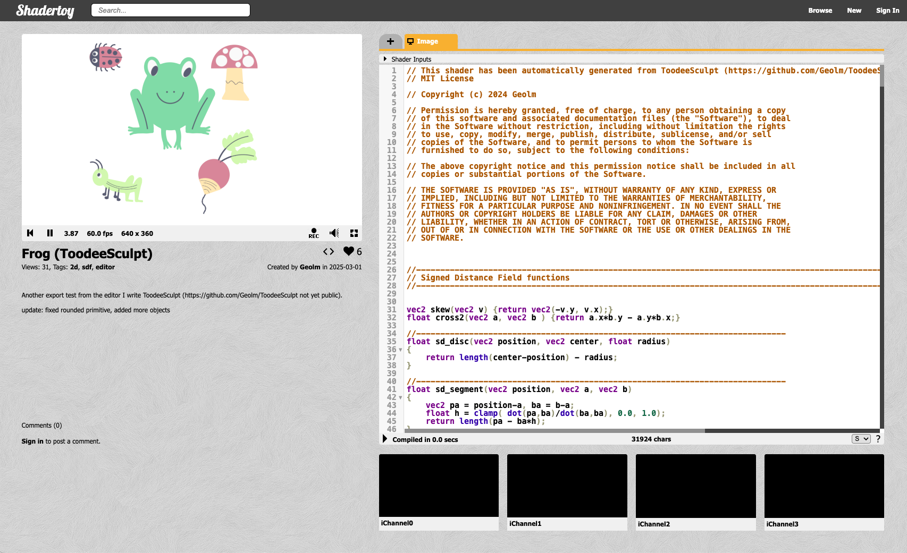

# ToodeeSculpt

Combine [2d sdf primitives](https://iquilezles.org/articles/distfunctions2d/) with smooth operator to sculpt your shape

* the editor

* same shader exported in shadertoy

## Features
* Primitives : disc, triangle, oriented box, ellipse, pie, arc, spline, capsule
* Primitive can be rounded, rendered with outline
* Boolean operator : union, substraction, [smooth blend](https://iquilezles.org/articles/smin/)
* Intuitive editor, undo support, grid snapping, copy/paste, rotation, scaling
* Load/save, export to shadertoy

## GPU driven SDF renderer

This editor renders everything with a gpu-driven pipeline
* only a list of command is uploaded to the GPU
* binning, rasterization, blending is all done on GPU (i.e Compute shader + Draw Indirect)
* pixels are rendered once, all [blending](https://developer.nvidia.com/gpugems/gpugems3/part-iv-image-effects/chapter-23-high-speed-screen-particles) is done in the shader (a.k.a free alpha blending)
* anti-aliasing based on sdf

Find more details in the the [documentation of the renderer](/doc/renderer.md)

## How to build
### Prerequisite
* a macOS dev environment (xcode tools)
* brew install glfw
* cmake
### Compilation
* open a terminal in the folder
* mkdir build
* cd build
* cmake -DCMAKE_BUILD_TYPE=Release ..
* cmake --build .
* ./ToodeeSculpt

It only has been tested on a M2 Max running macOS 12.7.1