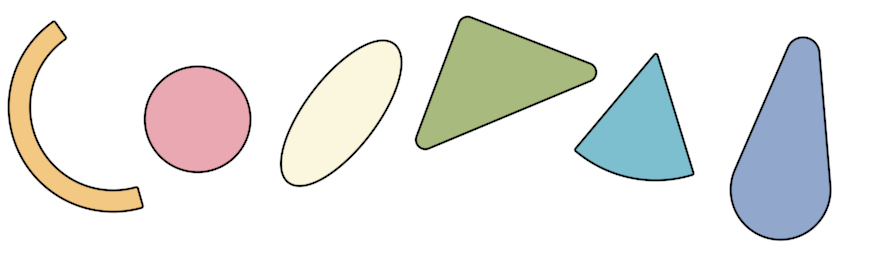

# Renderer documentation (wip)

We built our renderer to draw 2d primitive based on signed distance field (SDF). It's a GPU based renderer where most of the job is done on the GPU via indirect calls. The renderer consists in 4 parts

* creation of the global draw commands list (CPU)
* primitives transform and animation (CPU for now but planned to be on GPU)
* tile binning and linked list generation (GPU)
* rasterization (GPU)

Here are some specific features of this renderer :

* **anti-aliasing** : all primitives are anti-aliased without additionnal rendertarget or a fullscreen effect. It's almost free
* **alpha-blending** : all blending is done in the shader, you can stack as much alpha blended primitive you want. You pay only once the cost of alpha blending
* **no polygons** : perfect curves, curves do not cost more than straight lines, all shapes can be rounded for no cost
* **boolean operations** on primitives, we also support smooth blend (see https://iquilezles.org/articles/smin/)

## 1 - Draw command list

We build the command lists on the CPU, as it's 2d rendering the **order** of commands is important. A command describes a primitive. Here's the list of primitive currently supported :
* disc
* oriented box
* pie
* arc
* uneven capsule
* oriented ellipse
* triangle

Each command also have:
* a fill mode : solid, hollow or outline
* a color RGBA8
* a clip index that reference a clip rectangle
* an boolean operation : add, smooth add, sub, intersection
* an index to the primitive float data

All data the primitive (coordinates, radius, width, ...) is stored in a big float buffer that each command points at.

## 2 - Animation, projection, preparation

This compute shader works on the draw commmand lists, each thread works on a single command.

### Animation (not yet implemented)

Animate the primitive points/distances using analytical animation track.

### Projection

Transform the coordinates and distance from the viewport space to screen space.

### Preparation

Prepare the command for the tile binning and rasterization.

* bounding box : to accelerate the binning phase, we precompute a bounding box quantized to the tile size. A little math is involved to get a fit aabb for any primitive.
* primitive data : the intuitive data for some primitive needs to be transformed for the rasterization algorithm. For example : we define an arc with 3 points but the rasterization algorithm needs a direction vector, the cosinus and sinus of the aperture, the radius and the center of the arc.

## 3 - Tile binning

## 4 - Rasterization

* [blending](https://developer.nvidia.com/gpugems/gpugems3/part-iv-image-effects/chapter-23-high-speed-screen-particles)